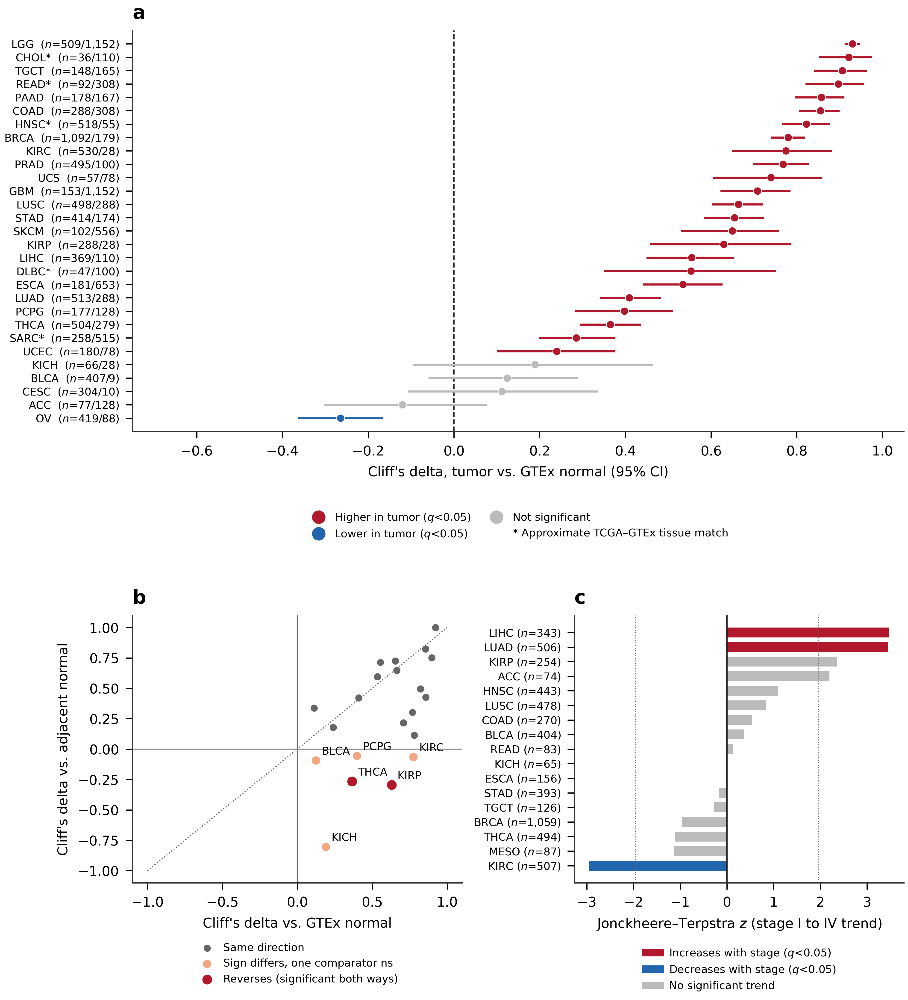
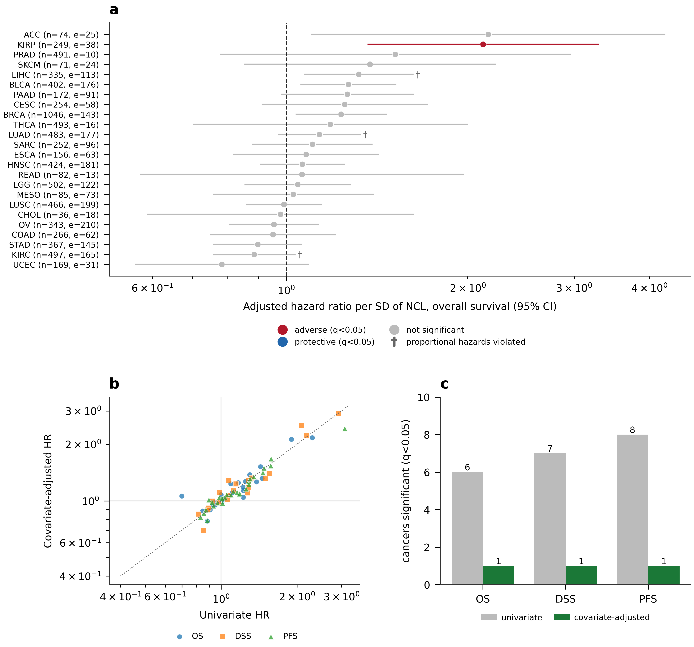
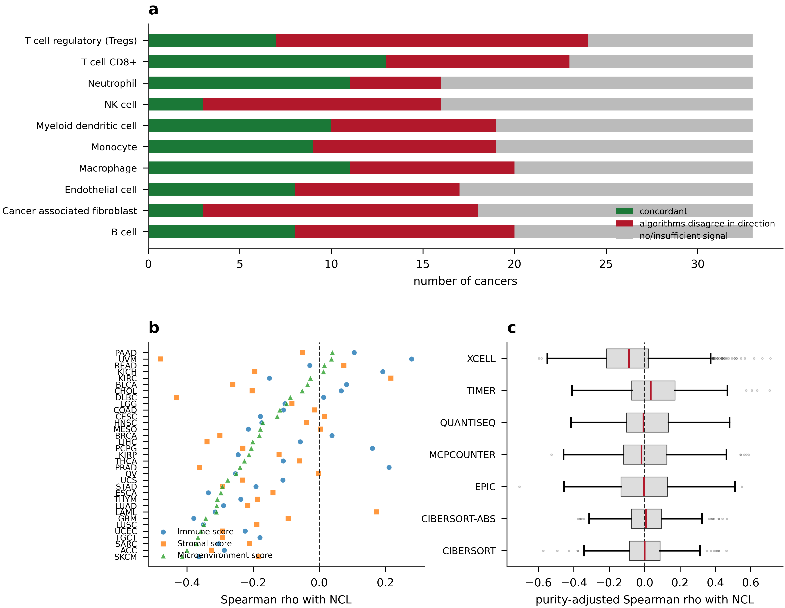
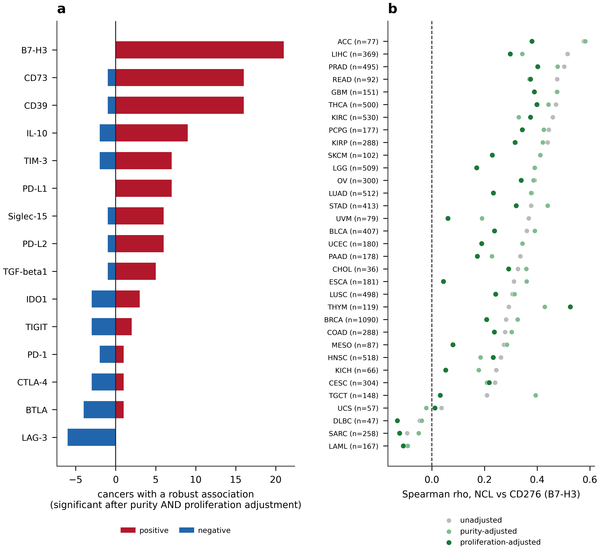
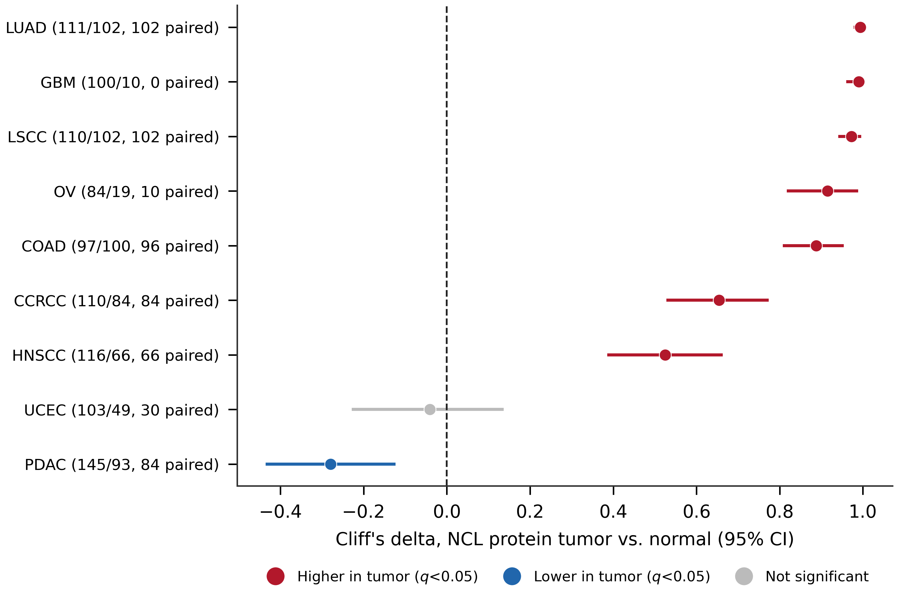
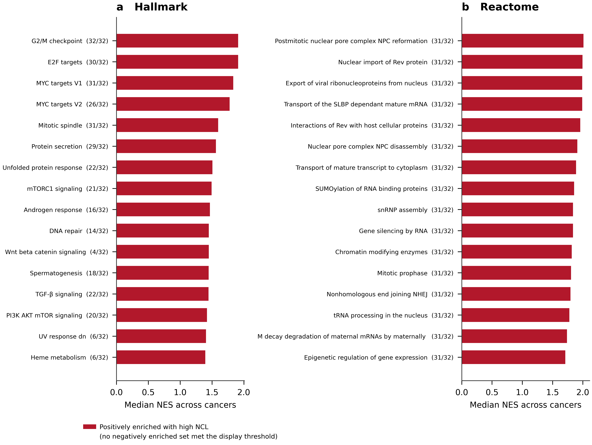

# Nucleolin Is Associated with B7-H3 and an Immune-Excluded Phenotype Across Human Cancers: A Pan-Cancer Analysis of 9,358 Tumours

Kruthika Prakash^1^, Janani Balaji^1^, Surya Babu^1^, Ramya Lakshmi Rajendran^2,3,4^, Prakash Gangadaran^2,3,4,\*^, ArulJothi Kandasamy Nagarajan^1,\*^ and Byeong-Cheol Ahn^2,3,4,5,\*^

^1^Department of Genetic Engineering, College of Engineering and Technology, SRM Institute of Science and Technology, Kattankulathur, Chengalpattu, Tamil Nadu, India – 603203
^2^BK21 FOUR KNU Convergence Educational Program of Biomedical Sciences for Creative Future Talents, Department of Biomedical Sciences, School of Medicine, Kyungpook National University, Daegu 41944, Republic of Korea
^3^Department of Nuclear Medicine, School of Medicine, Kyungpook National University, Daegu 41944, Republic of Korea
^4^Cardiovascular Research Institute, Kyungpook National University, Daegu 41944, Republic of Korea
^5^Department of Nuclear Medicine, Kyungpook National University Hospital, Daegu 41944, Republic of Korea

**\*Correspondence:**
Prof. ArulJothi Kandasamy Nagarajan, aruljotn@srmist.edu.in; Tel: +91-784-520-6014
Prof. Prakash Gangadaran, prakashg@knu.ac.kr; Tel: +82-53-420-4914
Prof. Byeong-Cheol Ahn, abc2000@knu.ac.kr; Tel: +82-53-420-5583

---

## Significance statement

Nucleolin (NCL) is an established cancer target, but its relationship to the tumour immune microenvironment has not been examined systematically. Across 9,358 tumours from 33 cancer types we show that NCL marks a proliferative, immune-excluded phenotype and co-expresses with tumour-cell-intrinsic immunosuppressive ligands, most consistently B7-H3 (CD276) and additionally CD73 and CD39, rather than with T-cell checkpoint receptors. We further show that total NCL transcript abundance carries little prognostic information independent of stage and grade, which is consistent with prior immunohistochemical evidence that the prognostic effect of NCL depends on its subcellular localisation. NCL-high, immune-excluded tumours may represent a setting in which B7-H3-directed rather than T-cell-checkpoint-directed strategies are worth evaluating.

## Abstract

Nucleolin (NCL) is an established cancer target that has been proposed to shape the tumour immune microenvironment, but this has not been tested systematically across cancers. We analysed 9,358 TCGA tumours from 33 cancer types against 7,262 GTEx and 727 adjacent normal samples using uniformly reprocessed transcriptomes, assessing differential expression by Wilcoxon tests with Cliff's delta and stage association by the Jonckheere–Terpstra trend test. Three survival endpoints were modelled by multivariable Cox regression adjusting for age, sex, stage and grade, with proportional-hazards checks. Immune infiltration was estimated by seven deconvolution algorithms as purity-adjusted partial correlations, with checkpoint correlations additionally proliferation-adjusted. All test families were Benjamini–Hochberg corrected and findings validated in nine independent CPTAC proteomic cohorts. NCL was overexpressed in 24 of 29 evaluable cancers (Cliff's delta up to +0.93) and reduced in ovarian carcinoma; seven of nine CPTAC cohorts confirmed elevated NCL protein. A stage-ordered increase was present in only 2 of 17 cancers, and after covariate adjustment and FDR correction NCL remained independently prognostic in only two, KIRP (overall survival HR 2.12, 95% CI 1.37–3.29) and ACC (progression-free HR 2.41, 1.40–4.16). NCL correlated negatively with the microenvironment score in every cancer where the association was significant, and positively with B7-H3 in 21 of 33 cancers, whereas CTLA-4, PD-1 and TIM-3 were largely uncorrelated. NCL therefore associates with tumour-intrinsic immunosuppressive ligands and an immune-excluded phenotype rather than T-cell checkpoints, and its transcript-level prognostic value is limited, consistent with prior evidence that this effect is localisation-dependent.

**Keywords:** nucleolin; NCL; pan-cancer analysis; B7-H3; tumour immune microenvironment; prognostic biomarker; The Cancer Genome Atlas

---

## 1. Introduction

Cancer remains among the leading causes of morbidity and mortality worldwide, and the identification of molecules that are both mechanistically informative and clinically actionable continues to be a central objective of translational oncology.^1,2^ Large public consortia, most notably The Cancer Genome Atlas (TCGA), the Genotype-Tissue Expression project (GTEx) and the Clinical Proteomic Tumor Analysis Consortium (CPTAC), have made it feasible to evaluate a candidate molecule across the full spectrum of human malignancy rather than one tumour type at a time.^3–5^ This capability has produced a large literature of "pan-cancer biomarker" reports. It has also produced a recognised methodological problem: such analyses frequently rely on univariate association testing, apply no correction for the many thousands of comparisons performed, and report statistical significance without effect sizes, so that findings which are real but negligible are presented as clinically meaningful.^6,7^

Nucleolin (NCL) is a highly conserved, multifunctional phosphoprotein that is predominantly nucleolar but also shuttles to the nucleoplasm, cytoplasm and cell surface.^8,9^ It participates in ribosome biogenesis, ribosomal RNA processing, chromatin remodelling, mRNA stability and the cellular stress response, and it is required for the high rates of ribosome production that proliferating cells demand.^10,11^ Cell-surface NCL has attracted particular attention because it is accessible to targeting agents: aptamers such as AS1411, the pseudopeptide N6L and the F3 peptide all exploit surface NCL, and several have entered early-phase evaluation.^12–14^ NCL has been reported as overexpressed and prognostically adverse in individual malignancies including endometrial carcinoma, lung cancer, hepatocellular carcinoma and pancreatic ductal adenocarcinoma, and a meta-analysis has argued that its subcellular localisation determines its prognostic direction.^15–18^

Two questions nevertheless remain open. First, it is unclear whether NCL carries prognostic information that is *independent* of the clinical variables oncologists already use. NCL expression is tightly coupled to proliferation, and proliferation is itself associated with tumour grade and stage; an association between NCL and survival may therefore be a restatement of established prognostic factors rather than an addition to them. Distinguishing these possibilities requires multivariable modelling, which the existing NCL literature has largely not performed. Second, NCL has been proposed to shape the tumour immune microenvironment. Nucleolin targeting reduces immunosuppression in pancreatic cancer models, and the MDK–NCL axis has been implicated in an immunosuppressive niche in endometrial carcinoma.^14,19^ Whether a relationship between NCL and immune phenotype exists consistently across cancers, in which direction, and whether it can be separated from the generic association between proliferation and immune content, has not been established.

A further consideration is methodological and specific to immune analyses. Transcriptome deconvolution algorithms differ in their reference signatures, in whether their outputs are comparable between cell types or only between samples, and in their sensitivity to tumour purity.^20–24^ Estimates for nominally the same cell type can therefore disagree, including in sign. When a single algorithm is selected for each result, the reported associations may reflect that choice rather than the underlying biology. Reporting several algorithms and quantifying their concordance is a more conservative and more interpretable approach.

The present study addresses these questions systematically. Using uniformly reprocessed transcriptomes so that tumour and normal tissue are directly comparable, we characterise NCL expression across 33 cancer types against both GTEx and adjacent normal references; we test stage association with a test appropriate to ordered categories; we model three survival endpoints with multivariable Cox regression including formal proportional-hazards diagnostics; we quantify immune associations across seven deconvolution algorithms with purity adjustment and report their concordance; we test the immune-checkpoint associations directly, with adjustment for proliferation as a potential confounder; and we seek independent confirmation in CPTAC proteomic cohorts. Every family of tests is corrected for multiple comparisons and every association is reported with an effect size and confidence interval.

## 2. Materials and Methods

All analyses were performed in Python 3.14 using NumPy,^25^ SciPy,^26^ pandas, statsmodels, `lifelines`^27^ and `gseapy`.^28^ Analysis code, intermediate result tables and the exact software environment are openly available (see Data availability), and the workflow is documented step by step in the accompanying repository.

### 2.1 Expression data and cohort definition

Transcriptome data were obtained from the UCSC Xena Toil recompute of TCGA, TARGET and GTEx (dataset `TcgaTargetGtex_rsem_gene_tpm`), comprising 60,498 genes across 19,131 samples quantified as log₂(TPM + 0.001).^3,29,30^ This resource was chosen deliberately: TCGA and GTEx were originally processed with different pipelines, and comparing them directly introduces batch effects that can exceed the biological differences of interest. The Toil recompute applies a single alignment and quantification pipeline to both, which is what makes a tumour-versus-GTEx comparison defensible.

Samples were assigned to 33 TCGA cohorts using the Xena phenotype annotation. Tumour samples were those designated "Primary Tumor" or, for LAML, "Primary Blood Derived Cancer – Peripheral Blood". Two classes of normal comparator were defined: TCGA adjacent normal tissue ("Solid Tissue Normal"), and GTEx normal tissue matched to each cancer's tissue of origin. Each TCGA–GTEx pairing was annotated with a match quality of *good*, *approximate* or *none*; approximate pairings (CHOL–liver, HNSC–salivary gland, READ–colon, SARC–adipose, DLBC–spleen, LAML–bone marrow) are reported but flagged, and cancers with no acceptable GTEx counterpart (MESO, THYM, UVM) were analysed against adjacent normals only. The full mapping with quality annotations is given in Supplementary Table S1 and in `scripts/cohorts.py`.

Expression values in this resource are RSEM-derived transcript-per-million estimates.^31^ Gene identifiers were mapped from GENCODE v23^32^ to gene symbols. Where a symbol mapped to several identifiers, the row with the highest mean expression was retained for single-gene analyses and the most variable row for correlation analyses.

### 2.2 Clinical, genomic and immune annotation

Clinical data, survival endpoints, tumour mutational burden and microsatellite instability scores for all 32 TCGA PanCancer Atlas studies were retrieved programmatically from cBioPortal.^33,34^ Survival endpoints are the curated definitions of the TCGA Clinical Data Resource, comprising overall survival (OS), disease-specific survival (DSS) and progression-free survival (PFS), which harmonise endpoint definitions across studies and are recommended in preference to raw TCGA follow-up fields.^35^ Covariates extracted were age at diagnosis, sex, AJCC pathological stage and histological grade. Tumour mutational burden (non-synonymous), MANTIS microsatellite-instability score, aneuploidy score and fraction of genome altered were also retrieved.^36^

Immune infiltration estimates for TCGA samples were downloaded from TIMER2.0, which provides pre-computed estimates from seven algorithms: TIMER,^37^ CIBERSORT, CIBERSORT-ABS, quanTIseq, MCP-counter, xCell and EPIC.^20–24,38^ xCell immune, stromal and microenvironment scores were taken from the same resource. Tumour purity was represented by the EPIC "uncharacterised cell" fraction, which is EPIC's explicit estimate of the compartment that is neither immune nor stromal.

### 2.3 Differential expression and stage association

For each cancer, NCL expression in tumours was compared with each normal comparator using two-sided Wilcoxon rank-sum tests. Effect sizes are reported as Cliff's delta^39^ with 95% percentile bootstrap confidence intervals (2,000 resamples), and additionally as Hedges' *g*.^40^ A non-parametric effect size was preferred because expression distributions are skewed and several cohorts have very small numbers of adjacent normals. Bootstrap intervals were used in preference to Cliff's asymptotic variance because that approximation is unreliable at the sample sizes some cohorts provide.

Association with pathological stage was assessed with the Jonckheere–Terpstra test for monotonic trend across ordered stages I–IV, using the tie-corrected normal approximation, alongside a Kruskal–Wallis test for any difference among stages.^41,42^ The distinction matters: a Kruskal–Wallis result establishes only that stages differ, not that expression rises with stage, and comparisons of each stage against normal tissue, as displayed by several web tools, do not test a stage-ordered trend at all. Cancers were included when at least three stage groups contained ≥5 patients and the cohort totalled ≥40 staged patients.

### 2.4 Survival analysis

For each cancer and each endpoint (OS, DSS, PFS), NCL expression was z-scored within cohort so that hazard ratios are expressed per standard deviation and are comparable across cancers. Three models were fitted using `lifelines`:^27^ a log-rank test comparing patients above and below the cohort median (the univariate analysis reported in most prior work); a univariate Cox model on continuous NCL; and a multivariable Cox model including age, sex, stage and grade. Covariates were retained only where available for >80% of the cohort and showing more than one distinct value, and the covariates actually used are recorded for every model. Cancers were modelled when ≥30 patients and ≥10 events were available.

The proportional-hazards assumption was tested for every multivariable model using Schoenfeld residuals with rank-transformed time.^43^ Models in which the NCL term violated the assumption (p<0.05) are identified explicitly in Results and in Supplementary Table S4, because a hazard ratio from such a model summarises a time-varying effect and should not be read as a single constant risk multiplier.

### 2.5 Immune microenvironment analysis

For every combination of cancer, cell type and algorithm, the association between NCL expression and estimated infiltration was quantified as a Spearman correlation and as a partial Spearman correlation adjusting for tumour purity, implemented by regressing the ranks of both variables on the ranks of purity and correlating the residuals (t-test on n−3 degrees of freedom).

To assess robustness to algorithm choice, ten cell types resolvable by more than one algorithm were designated canonical. For each cancer and canonical cell type we recorded how many algorithms yielded a significant purity-adjusted association after FDR correction and whether they agreed in sign. A combination was called *concordant* when at least two algorithms were significant and none disagreed in direction, and *conflicting* when significant estimates of opposite sign were both present.

Associations between NCL and immune, stromal and microenvironment scores, tumour mutational burden, MANTIS MSI score, aneuploidy score and fraction of genome altered were computed as Spearman correlations, with confidence intervals obtained by Fisher *z* transformation using the standard error of Bonett and Wright.^44^

### 2.6 Immune checkpoint analysis

Sixteen immune checkpoint and immunomodulatory genes were examined: *CD274* (PD-L1), *PDCD1LG2* (PD-L2), *PDCD1* (PD-1), *CTLA4*, *HAVCR2* (TIM-3), *LAG3*, *TIGIT*, *IDO1*, *BTLA*, *VSIR* (VISTA), *SIGLEC15*, *CD276* (B7-H3), *IL10*, *TGFB1*, *ENTPD1* (CD39) and *NT5E* (CD73). For each cancer, the Spearman correlation between NCL and each gene was computed and reported in three forms: unadjusted; adjusted for tumour purity; and adjusted for proliferation.

The proliferation adjustment is essential to interpretation. NCL is a ribosome-biogenesis gene whose expression tracks proliferative rate, and proliferative tumours differ systematically in immune composition. A raw correlation between NCL and a checkpoint gene may therefore reflect nothing more specific than shared covariation with proliferation. The proliferation score was defined as the mean within-cohort z-score of ten canonical markers (*MKI67*, *PCNA*, *TOP2A*, *CCNB1*, *BUB1*, *AURKA*, *CDK1*, *TYMS*, *RRM2*, *TK1*). Associations described below as robust are those significant after both purity and proliferation adjustment.

### 2.7 Gene set enrichment analysis

For each cancer, all genes were ranked by their within-cancer Spearman correlation with NCL and analysed by pre-ranked GSEA against the MSigDB Hallmark and Reactome collections (v2024.1.Hs), with 1,000 permutations and gene sets restricted to 15–500 genes.^28,45–47^ Correlations were computed within cancers rather than across pooled samples: pooled pan-cancer correlations are dominated by tissue-of-origin differences in composition and do not describe any within-tumour relationship.

Ranked lists were restricted to genes expressed in the cancer concerned, defined as TPM > 1 in at least 25% of that cohort's tumours. Without this restriction approximately 10% of genes carried tied ranking statistics, because genes that are essentially undetected yield degenerate correlations that GSEA then orders arbitrarily; the restriction reduced ties to below 0.2%.

### 2.8 Independent proteomic validation

Protein-level validation used CPTAC cohorts accessed through the `cptac` Python package: BRCA, ccRCC, COAD, GBM, HNSCC, LSCC, LUAD, OV, PDAC and UCEC.^5^ CPTAC provides an independent patient series, measured by mass spectrometry rather than sequencing, at the protein rather than the transcript level, with adjacent normal tissue from the same patients, making it the most stringent validation available without new experimental work. Tumour and normal samples were compared by Wilcoxon rank-sum test with Cliff's delta, and by Wilcoxon signed-rank test where the same patient contributed both.

### 2.9 Multiple testing and reporting

Benjamini–Hochberg false discovery rate correction^7^ was applied within each family of tests: across cancers within each differential-expression comparator; across cancers within each survival endpoint and model type; across all cancer × cell type × algorithm infiltration tests; across all cancer × gene checkpoint tests; across all cancer × measure genomic-score tests; and across all GSEA tests. Adjusted values are reported as *q*. Significance was defined as q<0.05 throughout. Every association is reported with a point estimate, a 95% confidence interval and the sample size on which it rests.

### 2.10 Reproducibility

Analyses are deterministic given fixed random seeds (bootstrap resampling of Cliff's delta, seed 0, 2,000 resamples; GSEA permutation, seed 0, 1,000 permutations). Because the public resources used here are not archival (UCSC Xena, TIMER2.0 and MSigDB reissue files at stable URLs, cBioPortal serves a live API, and the `cptac` package retrieves data at run time), a run manifest recording the SHA-256 checksum, byte size and retrieval date of every input file, the shape and checksum of every result table, and the resolved version of every package affecting a numeric result is generated by `11_manifest.py` and distributed with the code. Differences between a future run and the values reported here can therefore be localised to a specific input, package version or code change. Statistical utility functions were verified against brute-force implementations and against `statsmodels` before use, including a null-calibration check confirming a 5.7% type-I error rate for the trend test under the null and confirmation that a non-monotonic pattern is not reported as a trend. The complete workflow, environment specification, verification suite, run manifest and all intermediate result tables are openly available at https://github.com/ApexBlue11/NCL-PanCancer-Analysis.

## 3. Results

### 3.1 NCL is overexpressed across most cancers, and the choice of normal comparator matters

Across 29 cancers with an acceptable GTEx comparator, NCL was significantly overexpressed in tumours in 24 (all q<0.05), showing no significant difference in four (ACC, CESC, BLCA, KICH) and significantly reduced expression in one, ovarian serous cystadenocarcinoma (Cliff's delta −0.27, 95% CI −0.36 to −0.17, q=1.1×10⁻⁴) (Figure 1a; Table 1). Effect sizes were large in several cancers: LGG (delta +0.93, 95% CI +0.91 to +0.94, q=1.3×10⁻¹⁹⁹), CHOL (+0.92, +0.85 to +0.97), TGCT (+0.91, +0.84 to +0.96), READ (+0.90, +0.82 to +0.96), PAAD (+0.86, +0.80 to +0.91) and COAD (+0.86, +0.81 to +0.90).

An important qualification emerged when the same comparison was repeated against TCGA adjacent normal tissue (Figure 1b). Twelve cancers were significant against both comparators; ten agreed in direction, but two did not. In KIRP, NCL was higher than GTEx kidney (delta +0.63, q=5.1×10⁻⁸) yet lower than adjacent normal kidney (delta −0.29, q=1.1×10⁻²). The same reversal occurred in THCA (+0.37 versus −0.27), and the discordance extended to KICH (+0.19, not significant, versus −0.80, q=1.6×10⁻⁸) and KIRC (+0.78 versus −0.07, not significant). The kidney and thyroid are therefore cancers in which the reported direction of NCL dysregulation is determined by the reference tissue chosen rather than by the tumour. Adjacent normal kidney is not histologically inert: it is subject to field effects, inflammation and, in nephrectomy specimens, ischaemic injury, whereas GTEx tissue is post-mortem, and ribosome-biogenesis genes such as NCL are sensitive to both. We therefore report both comparators throughout and restrict confident claims of overexpression to cancers where they agree.

This has practical consequences for how NCL is described in individual cancers. Reports that NCL is reduced in renal or thyroid tumours are reconcilable with reports that it is elevated: both can be correct, depending on the reference tissue used. In cancers where the two comparators agree, including READ (delta +0.90, q=2.2×10⁻³⁸) and SKCM (+0.65, q=4.3×10⁻²⁵), elevation is unambiguous.

### 3.2 A stage-ordered increase in NCL is the exception, not the rule

Across 17 cancers with sufficient staging data, a significant monotonic trend across stages I–IV was present in only three, and in one of these the direction was negative: LIHC (Jonckheere–Terpstra z=+3.47, q=0.005, n=343), LUAD (z=+3.45, q=0.005, n=506) and, decreasing, KIRC (z=−2.95, q=0.018, n=507) (Figure 1c; Table 2). Fourteen cancers showed no stage-ordered trend. The corresponding stage IV versus stage I effect sizes are modest even where the trend is significant: LUAD Cliff's delta +0.26 (95% CI +0.05 to +0.45) and KIRC −0.13 (−0.28 to +0.00).

This result warrants a methodological caution. Stage-stratified expression plots produced by several widely used web tools annotate each stage against *normal* tissue rather than against the preceding stage. Such annotations can be uniformly significant while expression is flat or falling across stages, and reading them as evidence of stage-wise progression will systematically overstate how often expression tracks stage. A trend test on the ordered groups is required, and when applied to NCL it supports a stage-ordered increase in a small minority of cancers. Even in LIHC, where the trend is significant, stage IV contains only six patients, so the trend is carried by stages I–III and the late-versus-early effect size is not distinguishable from zero (delta −0.01, 95% CI −0.53 to +0.53).

### 3.3 NCL is rarely an independent prognostic factor

Univariate analyses reproduced the pattern that has led NCL to be described as a prognostic biomarker: NCL was associated with overall survival in 6 of 24 cancers, with disease-specific survival in 7 of 21, and with progression-free survival in 8 of 29 (q<0.05).

After adjustment for age, sex, stage and grade, and FDR correction, this largely did not survive (Figure 2; Table 3). NCL remained independently associated with outcome in a single cancer per endpoint: KIRP for overall survival (HR 2.12 per SD, 95% CI 1.37–3.29, q=0.019, 38 events) and disease-specific survival (HR 2.90, 1.60–5.27, q=0.0099, 25 events), and ACC for progression-free survival (HR 2.41, 1.40–4.16, q=0.044, 38 events). The proportional-hazards assumption held for the NCL term in both, supporting interpretation of these hazard ratios as constant effects. Across all endpoints the assumption was violated in 10 of 74 models, consistently in KIRC and LUAD, and those hazard ratios are flagged in Table 3 and should not be read as time-invariant.

The attenuation between univariate and adjusted models is substantial and is worth stating concretely, because transcript-level NCL has been reported as prognostic in several of these cancers. In LIHC the univariate association is strong (q=0.006) but does not survive adjustment (HR 1.32, 95% CI 1.07–1.62, q=0.079); in HNSC the adjusted estimate is null (HR 1.06, 95% CI 0.91–1.25, q=0.72). KICH, frequently cited in this context, contains too few events in TCGA to support a multivariable model at all. The general pattern is that transcript-level NCL's apparent prognostic value is largely accounted for by variables already used clinically.

### 3.4 NCL marks an immune-excluded tumour phenotype

Across 3,910 cancer × cell type × algorithm tests, 1,229 purity-adjusted associations were significant at q<0.05. The dominant pattern was negative. NCL correlated inversely with the xCell microenvironment score in all 20 cancers where the association was significant, with the immune score in 18 of 20 (positive only in PRAD and UVM), and with the stromal score in 14 of 15 (positive only in KIRC) (Figure 3a; Table 4). The strongest inverse immune-score associations were in GBM (rho −0.38, 95% CI −0.52 to −0.22, n=151), SKCM (−0.36, −0.53 to −0.17, n=102), LUSC (−0.35, −0.43 to −0.27, n=498) and ESCA (−0.34, −0.47 to −0.19, n=181). The microenvironment score showed the same pattern (SKCM −0.41, −0.57 to −0.23; ACC −0.40, −0.58 to −0.18; SARC −0.37, −0.48 to −0.25), as did the stromal score (UVM −0.48, −0.64 to −0.28; PRAD −0.36, −0.44 to −0.28; LIHC −0.34, −0.43 to −0.24). Only PRAD and UVM showed positive immune-score associations.

Cell-type-level results were consistent with this. Values below are the median purity-adjusted correlation across every algorithm that resolves the cell type, with the range of the estimates that reached significance in parentheses. Among the strongest concordant associations were reduced CD8⁺ T cells in SKCM (median rho −0.32; significant estimates −0.43 to −0.25 across 5 of 7 algorithms, n=102) and ACC (−0.31; −0.34 to −0.31, 4 of 7, n=77); reduced macrophages in GBM (−0.46; −0.46 to −0.46, n=151), KIRP (−0.39; −0.44 to −0.39, n=288), LUSC (−0.33; −0.36 to −0.33, n=498) and OV (−0.32; −0.39 to −0.31, n=300); and reduced cancer-associated fibroblasts in PRAD (−0.46; −0.55 to −0.46, n=495). NCL-high tumours are thus, in general, immune- and stroma-poor, a phenotype consistent with a proliferative, tumour-cell-rich compartment.

The strongest positive cell-type association we observe illustrates why both purity adjustment and multi-algorithm reporting matter. NCL correlates with neutrophil infiltration in thyroid carcinoma at rho=0.54 when estimated by MCP-counter alone without purity adjustment. Across all six algorithms that resolve neutrophils, and after purity adjustment, the median estimate falls to +0.30; restricting to the four algorithms reaching significance gives a median of +0.39 with estimates spanning +0.25 to +0.54 (n=500). The association is real and directionally consistent, but its magnitude varies roughly two-fold with these choices.

### 3.5 Deconvolution algorithms frequently disagree

Of 330 cancer × canonical cell type combinations, only 83 (25%) were concordant, meaning at least two algorithms gave a significant purity-adjusted association with no disagreement in sign. In 109 combinations (33%) algorithms produced significant estimates of *opposite* direction for nominally the same cell type in the same cancer (Figure 3b).

This has a direct methodological implication. A pan-cancer immune association supported by a single deconvolution algorithm has roughly a one-in-three chance of being contradicted by another algorithm applied to the same data. Results in this section are therefore reported only where multiple algorithms agree. We regard single-algorithm immune associations, and particularly analyses in which the algorithm differs between comparisons, as insufficiently robust to support biological interpretation.

### 3.6 NCL correlates with tumour-intrinsic immunosuppressive ligands, not T-cell checkpoints

Testing 495 cancer × gene associations produced a clearly structured result (Figure 4; Table 5; Supplementary Table S7). After adjustment for both tumour purity and proliferation, the most consistent association by a wide margin was with *CD276* (B7-H3): positive and significant in 21 of 33 cancers, with no cancer showing a significant negative association (median rho +0.34). The strongest were ACC (rho +0.58, 95% CI +0.39 to +0.72, n=77), LIHC (+0.52, +0.43 to +0.59, n=369), PRAD (+0.50, +0.43 to +0.57, n=495), READ (+0.48, +0.29 to +0.63, n=92), GBM (+0.47, +0.33 to +0.60, n=151), THCA (+0.47, +0.40 to +0.54, n=500) and KIRC (+0.46, +0.38 to +0.53, n=530). After adjustment for both purity and proliferation the association is attenuated but retained, with partial correlations across the 21 robust cancers spanning +0.17 to +0.53. The twelve cancers in which the association was not robust were CHOL, DLBC, ESCA, KICH, LAML, MESO, PAAD, SARC, SKCM, TGCT, UCS and UVM, a group weighted towards the smallest cohorts and the non-carcinoma histologies. Associations with the two principal components of the adenosine axis followed the same pattern: *NT5E* (CD73) robust in 17 of 33 cancers, 16 of them positive (proliferation-adjusted rho up to +0.55; the single negative was COAD), and *ENTPD1* (CD39) in 17 of 33, again 16 positive (up to +0.56; the single negative was LAML).

By contrast, the T-cell checkpoint receptors were weakly and inconsistently associated, and where associations did reach significance they were as often negative as positive. PD-1 was robust in 3 of 33 cancers (positive in BLCA; negative in SKCM and THCA) and CTLA-4 in 4 of 33 (positive in BLCA; negative in LUSC, OV and THCA; median rho +0.02). TIGIT was robust in 5 (proliferation-adjusted rho −0.21 to +0.21), LAG-3 in 6, negative in all six (KIRC, OV, PRAD, SARC, THCA, UCS; −0.55 to −0.17), and TIM-3 in 9 of 33 (median rho +0.05; −0.25 to +0.35). For CTLA-4 and PD-1 the robust estimates spanned −0.25 to +0.15 and −0.27 to +0.12 respectively, so even where significant they are small and of inconsistent sign. PD-L1 was robust in 7 of 33, all positive (BLCA, BRCA, KICH, KIRC, LIHC, PAAD, PCPG; median rho +0.17), and TGF-β1 in 6 of 33.

This distinction is biologically coherent. B7-H3, CD73 and CD39 are expressed by tumour cells themselves, whereas PD-1, CTLA-4, LAG-3 and TIGIT are expressed principally by infiltrating lymphocytes. A tumour-cell-expressed gene such as NCL would be expected to covary with the former and not with the latter. Given the inverse relationship between NCL and immune content described above, to correlate negatively rather than positively with lymphocyte-restricted transcripts. That the observed pattern matches this expectation, and persists after adjustment for proliferation, argues that it is not merely an artefact of tumour cellularity.

It is worth stating the negative result explicitly, because NCL has been discussed in connection with classical checkpoint biology. Across 33 cancers we find no consistent association between NCL and PD-1, CTLA-4, LAG-3 or TIGIT, and only a weak one with PD-L1 and TGF-β1. The robust association is with B7-H3, which to our knowledge has not previously been linked to NCL.

### 3.7 NCL is largely unrelated to tumour mutational burden and microsatellite instability

NCL showed little relationship with genomic instability measures. Tumour mutational burden was significantly associated in 7 of 33 cancers (ACC, BRCA, LGG, LUAD, PRAD, STAD, THCA; median rho +0.06 overall, significant estimates −0.12 to +0.34), MANTIS MSI score in 10 of 32 (BRCA, CESC, DLBC, KIRC, LGG, LUSC, OV, PRAD, STAD, THCA; median rho +0.04, significant estimates −0.45 to +0.30, with equal numbers positive and negative), and aneuploidy score in 7 of 33 (median rho +0.04, −0.18 to +0.24). Fraction of genome altered was slightly more often associated (11 of 33, median rho +0.12). NCL therefore does not track the mutational processes that predict immune-checkpoint blockade response, which further distinguishes its immune association from a conventional immunogenicity signal.

### 3.8 Independent proteomic validation

In nine CPTAC cohorts with adjacent normal tissue, NCL protein was significantly more abundant in tumour in seven (Figure 5; Table 6): LUAD (Cliff's delta +0.99, q=5.1×10⁻³⁵, 102 matched pairs), LSCC (+0.97), GBM (+0.99), OV (+0.92), COAD (+0.89), ccRCC (+0.65) and HNSCC (+0.53). Paired analyses within patients gave the same conclusion wherever pairing was available.

Two cohorts diverged from the transcript-level results and are reported as such. In UCEC, NCL protein did not differ between tumour and normal (delta −0.04, q=0.69) despite modest transcript elevation. In PDAC, NCL protein was significantly *lower* in tumour (delta −0.28, 95% CI −0.43 to −0.13, q=3.2×10⁻⁴) whereas the transcript was strongly elevated in TCGA PAAD (delta +0.86). Pancreatic tumours have a high stromal content and low epithelial cellularity, and bulk transcript and bulk protein measurements weight these compartments differently; discordance of this kind is a known feature of pancreatic proteogenomic data. We therefore do not claim protein-level overexpression of NCL in pancreatic cancer.

Notably, the ccRCC proteomic result (+0.65) supports the GTEx-based direction in kidney cancer rather than the adjacent-normal direction, providing independent evidence relevant to the comparator discordance described in Section 3.1.

### 3.9 NCL is coupled to proliferation and RNA metabolism in every cancer

Pre-ranked GSEA of genes ranked by their within-cancer correlation with NCL produced 32,491 tests across 32 cancers, of which 9,349 were significant at q<0.05 (Figure 6; Supplementary Table S10). The result was strikingly uniform.

In the Hallmark collection, the G2M checkpoint signature was positively enriched in **all 32 cancers** (median NES +1.91). MYC targets V1 was enriched in 31 of 32 (+1.83; the exception was OV), the mitotic spindle signature in 31 of 32 (+1.60; exception KICH), E2F targets in 30 of 32 (+1.91; exceptions THCA and THYM) and MYC targets V2 in 26 of 32 (+1.78; exceptions KICH, KIRP, PCPG, THCA, THYM and UVM). Every one of these enrichments was positive; none was significantly negative in any cancer. Further positively enriched sets included the unfolded protein response (22 of 32), mTORC1 signalling (21 of 32), PI3K–AKT–mTOR signalling (20 of 32) and DNA repair (14 of 32). Only one signature was consistently depleted, and in only three cancers (coagulation; DLBC, SARC and TGCT).

Reactome results were concordant and dominated by nuclear RNA metabolism: transport of mature transcripts to the cytoplasm, processing of capped intron-containing pre-mRNA, snRNP assembly, nuclear tRNA processing, gene silencing by RNA, SUMOylation of RNA-binding and DNA-repair proteins, chromatin-modifying enzymes and histone acetylation were each positively enriched in 31 of 32 cancers (median NES +1.7 to +2.0).

Two features of this result matter for interpretation. First, it recovers NCL's established biology (ribosome biogenesis, RNA processing and chromatin function) from an unsupervised, correlation-ranked analysis, which supports the validity of the ranking statistic. Second, and more importantly, **no immune or inflammatory signature appears among the consistently enriched pathways in either collection.** The pathways associated with NCL across cancers are those of a proliferating, biosynthetically active cell. This is the strongest single piece of evidence that NCL's immune associations (Sections 3.4–3.6) follow from the proliferative state of the tumour compartment rather than from a dedicated immunoregulatory programme, and it is why the checkpoint analysis in Section 3.6 was adjusted for proliferation before any association was described as robust.

TGF-β signalling was positively enriched in 22 of 32 cancers, whereas at the level of the individual gene *TGFB1* was robustly correlated with NCL in only 6 of 33 (Section 3.6). Pathway-level and gene-level results should not be conflated: enrichment of a signalling signature reflects coordinated movement of many downstream targets and does not imply that the ligand transcript itself tracks NCL.

## 4. Discussion

### 4.1 What this analysis establishes

Three conclusions follow. First, NCL overexpression in cancer is real, widespread and reproducible: it is elevated in 24 of 29 evaluable cancers at the transcript level, with large effect sizes, and confirmed at the protein level in an independent patient series in seven of nine cohorts. This is the best-supported claim about NCL in cancer and it survives rigorous testing.

Second, **total NCL transcript abundance carries little independent prognostic information**, and this is informative rather than merely negative. In 74 multivariable models across three endpoints, NCL remained significant after covariate adjustment and FDR correction in two cancers.

This result should be read alongside, not against, the existing prognostic literature. The most systematic prior assessment is a meta-analysis of 12 immunohistochemistry studies in 1,221 patients across eight cancer types, which found that *cytoplasmic* NCL was strongly associated with poor overall survival (HR 4.32, 95% CI 3.01–6.19) while *nuclear* NCL was associated with **improved** survival (HR 0.42, 0.20–0.86), and which described the role of total NCL as controversial.^8^ Bulk transcriptome measurement cannot distinguish these compartments: it sums a fraction that is adverse and a fraction that is protective. On that reading, the near-absence of an independent transcript-level prognostic effect is close to what the localisation hypothesis predicts, and our result supports rather than contradicts it.

The practical implication is specific. If NCL is to be used prognostically, the measurement must resolve subcellular localisation, which means immunohistochemistry or an equivalent spatial assay rather than bulk expression. Reports of transcript-level NCL prognostic value in individual cancers, including our own earlier analysis, should be interpreted with that constraint in mind, particularly where clinical covariates were not modelled: the attenuation we observe between univariate and adjusted models is exactly what one expects of a proliferation-coupled gene, since proliferation is already embedded in grade and stage.

Third, the relationship between NCL and the tumour immune microenvironment is consistent across cancers but is not the relationship that has been assumed. NCL-high tumours are immune- and stroma-poor. Where NCL does correlate positively with an immune-relevant molecule, that molecule is characteristically expressed by tumour cells rather than by lymphocytes.

### 4.2 B7-H3 as the principal immune association

The most robust immune finding is the association between NCL and B7-H3 (CD276), positive in 21 of 33 cancers after adjustment for both purity and proliferation, and negative in none. B7-H3 is an attractive comparison for NCL: both are broadly overexpressed across carcinomas, both reach the tumour-cell surface, and both are being pursued as surface-targeting opportunities. B7-H3 is currently the subject of extensive clinical development, including antibody–drug conjugates and CAR-T approaches, and is notable for being expressed in tumours that are not inflamed, the immune-excluded setting in which conventional PD-1/PD-L1 blockade performs poorly.^48^

The co-occurrence of NCL and B7-H3 in an immune-excluded context, together with the parallel associations with CD73 and CD39, suggests that NCL-high tumours may be characterised less by classical T-cell exhaustion than by an adenosine-mediated, tumour-cell-intrinsic mode of immune evasion.^49^ We emphasise that this is an association-level observation and a hypothesis for testing, not a demonstrated mechanism; nothing in these data establishes that NCL regulates B7-H3 or that either is causal for the immune phenotype. The relevant experiment, perturbing NCL and measuring B7-H3 and immune composition, has not been performed here.

### 4.3 Pathway context

The enrichment results are unusually consistent and place the immune findings in context. Across 32 cancers, the programmes associated with NCL are those of proliferation and nuclear RNA metabolism: the G2M checkpoint signature in every cancer without exception, MYC and E2F target sets in almost all, and Reactome sets covering mRNA processing and export, snRNP assembly, tRNA processing and chromatin modification in 31 of 32.

That this analysis recovers NCL's canonical biology from an unsupervised, correlation-ranked procedure is reassuring about the method. What it adds is the absence: no immune or inflammatory programme is consistently enriched in either collection. Taken with the negative correlations against immune, stromal and microenvironment scores, this supports reading NCL as a marker of the biosynthetic and proliferative state of the tumour compartment, whose immune associations follow from that state rather than from a dedicated immunoregulatory function.

This is also why we regard the B7-H3 result as the most interesting finding rather than a corollary of proliferation. Proliferation is the dominant axis of NCL covariation, so an immune association that persists after explicit adjustment for a proliferation score, as the B7-H3, CD73 and CD39 associations do while most T-cell checkpoint associations do not, is not simply a restatement of that axis.

### 4.4 Methodological implications

Two methodological observations from this work generalise beyond NCL.

The first concerns deconvolution. One third of the cancer × cell type combinations we examined produced significant estimates of *opposite* sign depending on the algorithm used. Since a typical pan-cancer immune analysis reports one algorithm, and since algorithms are often selected after inspecting results, the field's immune-association literature is likely to contain a substantial number of associations that would reverse under a different but equally defensible choice. Reporting concordance across algorithms costs little and is considerably more informative than a single point estimate.

The second concerns the choice of normal comparator. In kidney and thyroid cancers the direction of NCL dysregulation depends on whether GTEx or adjacent normal tissue is used. Neither is simply correct: adjacent normal tissue shares the patient's genetic background and exposures but is subject to field effects and surgical ischaemia, while GTEx tissue is unaffected by the tumour but post-mortem and from different individuals. For genes sensitive to metabolic and ischaemic state, which includes most of the ribosome-biogenesis machinery, this choice is consequential and should be reported rather than made silently.

## 5. Limitations

The central limitation is that this study generates no new experimental data. We have validated as far as is possible computationally, in an independent patient series measured on an orthogonal platform at the protein level with paired adjacent normal tissue (CPTAC). This is a genuine and reasonably stringent form of external validation, and it substantiates the overexpression claim. It is not, however, a substitute for functional experimentation, and none of the mechanistic hypotheses advanced in Section 4.2 is tested by it. The association between NCL and B7-H3 in particular requires perturbation experiments, namely NCL knockdown or overexpression with measurement of B7-H3 and of immune composition, before any regulatory relationship can be claimed. We state plainly that this work does not provide that evidence.

Further limitations follow from the data sources. Transcriptome deconvolution infers cell composition from bulk expression and is not a measurement of infiltration; the poor cross-algorithm concordance documented in Section 3.5 is itself evidence of this limitation, and single-cell or spatial data would be required to resolve the cell-type associations convincingly. Six TCGA–GTEx tissue pairings are approximate and are flagged as such; three cancers have no acceptable GTEx counterpart. Several cohorts are small, including CHOL (36 tumours), KICH (65) and UCS (57), so that the absence of a significant association in those cancers reflects limited power as much as absence of effect, and KICH in particular could not be modelled for overall survival. Stage and grade are unavailable for some cancers, so the covariate set differs between models; the covariates used are recorded for every model. The proportional-hazards assumption was violated for the NCL term in 10 of 74 models, and those hazard ratios summarise time-varying effects. Finally, TCGA is predominantly composed of treatment-naive primary resections from a limited set of populations, and prognostic associations derived from it need not transfer to treated, metastatic or differently ascertained populations.

## 6. Conclusion

Nucleolin is broadly and reproducibly overexpressed across human cancers at both transcript and protein level, but it is only rarely an independent prognostic factor once the clinical variables already in routine use are accounted for; on the evidence presented here, kidney renal papillary cell carcinoma is the clearest exception. Its relationship to the tumour immune microenvironment is consistent but is not the one previously proposed: NCL marks an immune-excluded phenotype and co-expresses with tumour-cell-intrinsic immunosuppressive ligands, most consistently B7-H3 and the adenosine-pathway ectoenzymes CD73 and CD39, rather than with T-cell checkpoint receptors. These results argue for a more circumscribed view of NCL as a prognostic biomarker, and identify the NCL–B7-H3 relationship in immune-excluded tumours as the hypothesis most deserving of experimental test.

## Declarations

**Ethics approval and consent to participate:** Not applicable. This study analysed only publicly available, de-identified data from TCGA, GTEx and CPTAC, obtained under the data use policies of those consortia.

**Clinical trial number:** Not applicable.

**Consent for publication:** Not applicable.

**Availability of data and materials:** All primary data are publicly available. Transcriptome data: UCSC Xena Toil recompute (https://xenabrowser.net/datapages/, dataset `TcgaTargetGtex_rsem_gene_tpm`). Clinical, survival, TMB and MSI data: cBioPortal (https://www.cbioportal.org), TCGA PanCancer Atlas studies. Immune infiltration estimates: TIMER2.0 (http://timer.cistrome.org). Gene sets: MSigDB v2024.1.Hs (https://www.gsea-msigdb.org). Proteomic data: CPTAC via the `cptac` Python package. No new data were generated by this study.

**Code availability:** All analysis code, the pinned software environment, the run manifest recording input checksums and package versions, every intermediate result table and a step-by-step methodology document are openly available at https://github.com/ApexBlue11/NCL-PanCancer-Analysis. The pipeline reproduces every number and figure reported here from public data.

**Competing interests:** The authors declare that the research was conducted without any commercial or financial relationships that could be construed as a potential conflict of interest.

**Funding:** This work was supported by the National Research Foundation of Korea (NRF) grant funded by the Korea government (MSIT) (NRF-2022R1A2C2005057).

**Authors' contributions:** [To be confirmed by all authors for the revised manuscript, whose conclusions differ substantively from the previous version.]

**Use of AI and AI-assisted technologies:** An AI assistant (Anthropic Claude) was used during preparation of this revision for analysis code development, statistical implementation, execution of the computational workflow, and drafting and editing of manuscript text. All analyses were specified, inspected and verified by the authors; all statistical implementations were validated against reference implementations prior to use; and the authors take full responsibility for the integrity of the data, the accuracy of the analyses and the content of the manuscript. No AI system is an author, and no AI system was used to generate or fabricate data.

**Acknowledgements:** The authors thank the peer reviewers, whose criticisms substantially shaped the analyses reported here, and acknowledge TCGA, GTEx, CPTAC and their participants, without whose data this work would not be possible.

## References

1. Bray F, Laversanne M, Sung H, Ferlay J, Siegel RL, Soerjomataram I, et al. Global cancer statistics 2022: GLOBOCAN estimates of incidence and mortality worldwide for 36 cancers in 185 countries. CA Cancer J Clin. 2024;74(3):229–263.
2. Piña-Sánchez P, Chávez-González A, Ruiz-Tachiquín M, Vadillo E, Monroy-García A, Montesinos JJ, et al. Cancer biology, epidemiology, and treatment in the 21st century: current status and future challenges from a biomedical perspective. Cancer Control. 2021;28:10732748211038735.
3. Cancer Genome Atlas Research Network, Weinstein JN, Collisson EA, Mills GB, Shaw KR, Ozenberger BA, et al. The Cancer Genome Atlas Pan-Cancer analysis project. Nat Genet. 2013;45(10):1113–1120.
4. GTEx Consortium. The Genotype-Tissue Expression (GTEx) pilot analysis: multitissue gene regulation in humans. Science. 2015;348(6235):648–660.
5. Ellis MJ, Gillette M, Carr SA, Paulovich AG, Smith RD, Rodland KK, et al. Connecting genomic alterations to cancer biology with proteomics: the NCI Clinical Proteomic Tumor Analysis Consortium. Cancer Discov. 2013;3(10):1108–1112.
6. Ioannidis JP. Why most published research findings are false. PLoS Med. 2005;2(8):e124.
7. Benjamini Y, Hochberg Y. Controlling the false discovery rate: a practical and powerful approach to multiple testing. J R Stat Soc Series B Stat Methodol. 1995;57(1):289–300.
8. Yangngam S, Prasopsiri J, Hatthakarnkul P, Thongchot S, Thuwajit P, Yenchitsomanus PT, et al. Cellular localization of nucleolin determines the prognosis in cancers: a meta-analysis. J Mol Med (Berl). 2022;100(8):1145–1157.
9. Berger CM, Gaume X, Bouvet P. The roles of nucleolin subcellular localization in cancer. Biochimie. 2015;113:78–85.
10. Mongelard F, Bouvet P. Nucleolin: a multiFACeTed protein. Trends Cell Biol. 2007;17(2):80–86.
11. Jia W, Yao Z, Zhao J, Guan Q, Gao L. New perspectives of physiological and pathological functions of nucleolin (NCL). Life Sci. 2017;186:1–10.
12. Bates PJ, Reyes-Reyes EM, Malik MT, Murphy EM, O'Toole MG, Trent JO. G-quadruplex oligonucleotide AS1411 as a cancer-targeting agent: uses and mechanisms. Biochim Biophys Acta Gen Subj. 2017;1861(5 Pt B):1414–1428.
13. Gilles ME, Maione F, Cossutta M, Carpentier G, Caruana L, Di Maria S, et al. Nucleolin targeting impairs the progression of pancreatic cancer and promotes the normalization of tumor vasculature. Cancer Res. 2016;76(24):7181–7193.
14. Ponzo M, Debesset A, Cossutta M, Chalabi-Dchar M, Houppe C, Pilon C, et al. Nucleolin therapeutic targeting decreases pancreatic cancer immunosuppression. Cancers (Basel). 2022;14(17):4265.
15. Lin Q, Ma X, Hu S, Li R, Wei X, Han B, et al. Overexpression of nucleolin is a potential prognostic marker in endometrial carcinoma. Cancer Manag Res. 2021;13:1955–1965.
16. Ezzatifar F, Rafiei A, Jeddi-Tehrani M. Nucleolin: a tumor associated antigen as a potential lung cancer biomarker. Pathol Res Pract. 2022;240:154160.
17. Ying J, Pan R, Tang Z, Zhu J, Ren P, Lou Y, et al. Downregulation of NCL attenuates tumor formation and growth in HeLa cells by targeting the PI3K/AKT pathway. Cancer Med. 2022;11(6):1454–1464.
18. Ugrinova I, Petrova M, Chalabi-Dchar M, Bouvet P. Multifaceted nucleolin protein and its molecular partners in oncogenesis. Adv Protein Chem Struct Biol. 2018;111:133–164.
19. Yu X, Xie L, Ge J, Li H, Zhong S, Liu X. Integrating single-cell RNA-seq and spatial transcriptomics reveals MDK-NCL dependent immunosuppressive environment in endometrial carcinoma. Front Immunol. 2023;14:1145300.
20. Newman AM, Liu CL, Green MR, Gentles AJ, Feng W, Xu Y, et al. Robust enumeration of cell subsets from tissue expression profiles. Nat Methods. 2015;12(5):453–457.
21. Finotello F, Mayer C, Plattner C, Laschober G, Rieder D, Hackl H, et al. Molecular and pharmacological modulators of the tumor immune contexture revealed by deconvolution of RNA-seq data. Genome Med. 2019;11(1):34.
22. Aran D, Hu Z, Butte AJ. xCell: digitally portraying the tissue cellular heterogeneity landscape. Genome Biol. 2017;18(1):220.
23. Becht E, Giraldo NA, Lacroix L, Buttard B, Elarouci N, Petitprez F, et al. Estimating the population abundance of tissue-infiltrating immune and stromal cell populations using gene expression. Genome Biol. 2016;17(1):218.
24. Racle J, de Jonge K, Baumgaertner P, Speiser DE, Gfeller D. Simultaneous enumeration of cancer and immune cell types from bulk tumor gene expression data. Elife. 2017;6:e26476.
25. Harris CR, Millman KJ, van der Walt SJ, Gommers R, Virtanen P, Cournapeau D, et al. Array programming with NumPy. Nature. 2020;585(7825):357–362.
26. Virtanen P, Gommers R, Oliphant TE, Haberland M, Reddy T, Cournapeau D, et al. SciPy 1.0: fundamental algorithms for scientific computing in Python. Nat Methods. 2020;17(3):261–272.
27. Davidson-Pilon C. lifelines: survival analysis in Python. J Open Source Softw. 2019;4(40):1317.
28. Fang Z, Liu X, Peltz G. GSEApy: a comprehensive package for performing gene set enrichment analysis in Python. Bioinformatics. 2023;39(1):btac757.
29. Vivian J, Rao AA, Nothaft FA, Ketchum C, Armstrong J, Novak A, et al. Toil enables reproducible, open source, big biomedical data analyses. Nat Biotechnol. 2017;35(4):314–316.
30. Goldman MJ, Craft B, Hastie M, Repečka K, McDade F, Kamath A, et al. Visualizing and interpreting cancer genomics data via the Xena platform. Nat Biotechnol. 2020;38(6):675–678.
31. Li B, Dewey CN. RSEM: accurate transcript quantification from RNA-Seq data with or without a reference genome. BMC Bioinformatics. 2011;12:323.
32. Frankish A, Diekhans M, Jungreis I, Lagarde J, Loveland JE, Mudge JM, et al. GENCODE 2021. Nucleic Acids Res. 2021;49(D1):D916–D923.
33. Cerami E, Gao J, Dogrusoz U, Gross BE, Sumer SO, Aksoy BA, et al. The cBio Cancer Genomics Portal: an open platform for exploring multidimensional cancer genomics data. Cancer Discov. 2012;2(5):401–404.
34. Gao J, Aksoy BA, Dogrusoz U, Dresdner G, Gross B, Sumer SO, et al. Integrative analysis of complex cancer genomics and clinical profiles using the cBioPortal. Sci Signal. 2013;6(269):pl1.
35. Liu J, Lichtenberg T, Hoadley KA, Poisson LM, Lazar AJ, Cherniack AD, et al. An integrated TCGA pan-cancer clinical data resource to drive high-quality survival outcome analytics. Cell. 2018;173(2):400–416.e11.
36. Kautto EA, Bonneville R, Miya J, Yu L, Krook MA, Reeser JW, et al. Performance evaluation for rapid detection of pan-cancer microsatellite instability with MANTIS. Oncotarget. 2017;8(5):7452–7463.
37. Li B, Severson E, Pignon JC, Zhao H, Li T, Novak J, et al. Comprehensive analyses of tumor immunity: implications for cancer immunotherapy. Genome Biol. 2016;17(1):174.
38. Li T, Fu J, Zeng Z, Cohen D, Li J, Chen Q, et al. TIMER2.0 for analysis of tumor-infiltrating immune cells. Nucleic Acids Res. 2020;48(W1):W509–W514.
39. Cliff N. Dominance statistics: ordinal analyses to answer ordinal questions. Psychol Bull. 1993;114(3):494–509.
40. Hedges LV. Distribution theory for Glass's estimator of effect size and related estimators. J Educ Stat. 1981;6(2):107–128.
41. Jonckheere AR. A distribution-free k-sample test against ordered alternatives. Biometrika. 1954;41(1–2):133–145.
42. Terpstra TJ. The asymptotic normality and consistency of Kendall's test against trend, when ties are present in one ranking. Indag Math. 1952;14:327–333.
43. Grambsch PM, Therneau TM. Proportional hazards tests and diagnostics based on weighted residuals. Biometrika. 1994;81(3):515–526.
44. Bonett DG, Wright TA. Sample size requirements for estimating Pearson, Kendall and Spearman correlations. Psychometrika. 2000;65(1):23–28.
45. Subramanian A, Tamayo P, Mootha VK, Mukherjee S, Ebert BL, Gillette MA, et al. Gene set enrichment analysis: a knowledge-based approach for interpreting genome-wide expression profiles. Proc Natl Acad Sci U S A. 2005;102(43):15545–15550.
46. Liberzon A, Birger C, Thorvaldsdóttir H, Ghandi M, Mesirov JP, Tamayo P. The Molecular Signatures Database (MSigDB) hallmark gene set collection. Cell Syst. 2015;1(6):417–425.
47. Gillespie M, Jassal B, Stephan R, Milacic M, Rothfels K, Senff-Ribeiro A, et al. The Reactome pathway knowledgebase 2022. Nucleic Acids Res. 2022;50(D1):D687–D692.
48. Koumprentziotis IA, Theocharopoulos C, Foteinou D, Angeli E, Anastasopoulou A, Gogas H, et al. New emerging targets in cancer immunotherapy: the role of B7-H3. Vaccines (Basel). 2024;12(1):54.
49. Allard B, Allard D, Buisseret L, Stagg J. The adenosine pathway in immuno-oncology. Nat Rev Clin Oncol. 2020;17(10):611–629.
## Figures

**Figure 1. NCL expression across cancers and pathological stages.** (a) Cliff's delta with 95% bootstrap confidence intervals for NCL expression in tumours versus GTEx normal tissue, ordered by effect size; point size indicates cohort size, and colour indicates TCGA–GTEx tissue match quality. Filled markers denote q<0.05 (Benjamini–Hochberg). (b) Comparison of effect sizes obtained against GTEx normals and against TCGA adjacent normals; points off the diagonal indicate comparator-dependent results, with KIRP, KICH, KIRC and THCA labelled. (c) Jonckheere–Terpstra standardised trend statistic for NCL across pathological stages I–IV; positive values indicate increasing expression with stage. Only cancers with ≥3 stage groups of ≥5 patients are shown. Sample sizes are given for all groups.

{width=100%}

**Figure 2. Survival analysis.** (a) Hazard ratios per standard deviation of NCL for overall survival, from multivariable Cox models adjusted for age, sex, stage and grade, with 95% confidence intervals; each row is annotated with the number of patients and events entering that model. Red indicates an adverse association significant at q<0.05, blue a protective one, grey not significant. A dagger marks models in which the proportional-hazards assumption was violated for the NCL term (Schoenfeld residuals, p<0.05); those hazard ratios summarise a time-varying effect and should not be read as constant risk multipliers. (b) Univariate against covariate-adjusted hazard ratio for every cancer and endpoint; points below the diagonal are cancers whose apparent prognostic signal is attenuated by adjustment. (c) Number of cancers reaching q<0.05 before and after adjustment, by endpoint. Full per-model results, including the covariates available in each cohort, are in Table 3.

{width=100%}

**Figure 3. Immune infiltration and cross-algorithm concordance.** (a) For each of ten canonical cell types, the number of cancers in which the algorithms *concordantly* detect an association with NCL (≥2 algorithms significant at q<0.05 after purity adjustment, none disagreeing in sign), the number in which algorithms return significant associations of **opposite sign** for the same cell type in the same cancer, and the number with no or insufficient signal. Each bar totals the 33 cancers analysed. What differs between cell types is the number of algorithms available to resolve them, ranging from two to seven: lowest for cancer-associated fibroblast, endothelial cell and macrophage (at most three) and highest for CD8⁺ T cell (up to seven). The algorithm count for every cancer and cell type is given in Supplementary Table S6. (b) Correlation between NCL and the xCell immune, stromal and microenvironment scores in each cancer; cancers are ordered by microenvironment score. Points to the left of zero indicate that NCL-high tumours are immune- or stroma-poor. (c) Distribution of purity-adjusted partial Spearman correlations between NCL and infiltration estimates, separately for each of the seven deconvolution algorithms, pooled over all cancers and cell types; the spread illustrates how much the estimate depends on the algorithm chosen.

{width=100%}

**Figure 4. Immune checkpoint associations.** (a) Number of the 33 cancers in which each molecule shows a *robust* association with NCL, defined as significant at q<0.05 after **both** tumour-purity and proliferation adjustment; bars extend right for positive and left for negative associations, so a molecule with bars on both sides is inconsistent in direction between cancers. Cancers not counted are those not reaching significance. (b) Per-cancer detail for CD276 (B7-H3), showing the same correlation unadjusted, purity-adjusted and proliferation-adjusted, with cohort size for each cancer; the ordering makes visible that adjustment attenuates but does not abolish the association. Cancers in which B7-H3 was not robust are named in Section 3.6.

{width=100%}

**Figure 5. Independent proteomic validation in CPTAC.** Cliff's delta with 95% bootstrap confidence intervals for NCL protein abundance in tumour versus adjacent normal tissue across nine CPTAC cohorts, with numbers of tumours, normals and matched pairs annotated. Cohorts discordant with the transcript-level result (PDAC, UCEC) are indicated.

{width=100%}

**Figure 6. Pathway associations.** Normalised enrichment scores from pre-ranked GSEA of genes ranked by within-cancer correlation with NCL, for Hallmark and Reactome gene sets showing consistent direction across cancers. The sixteen most frequently significant direction-consistent gene sets are shown for each collection. The fraction beside each pathway (e.g. 32/32, 26/32) is the number of the 32 analysable cancers in which that gene set reached q<0.05, out of the total tested; bar length is the median NES across the cancers in which it was significant. Cancers not counted are those in which the set did not reach significance, not those with opposite-direction enrichment; no gene set shown here was significantly enriched in opposing directions in different cancers. Section 3.9 names the exceptions for the near-complete sets, and the full per-cancer results are in Supplementary Table S10.

{width=100%}
## Tables

**Table 1.** NCL differential expression by cancer type, against GTEx and TCGA adjacent normal comparators: sample sizes, median expression, Cliff's delta with 95% CI, Hedges' *g*, and FDR-adjusted p-values.

| Cancer | n tumour | n GTEx | Cliff's delta (95% CI) | q | Tissue match | Adjacent-normal delta | Adjacent q |
| --- | --- | --- | --- | --- | --- | --- | --- |
| LGG | 509 | 1152 | +0.93 (+0.91, +0.94) | 1.3e-199 | good | n/a | n/a |
| CHOL | 36 | 110 | +0.92 (+0.85, +0.97) | 2.1e-16 | approximate | +1.00 | 1.2e-05 |
| TGCT | 148 | 165 | +0.91 (+0.84, +0.96) | 6.9e-43 | good | n/a | n/a |
| READ | 92 | 308 | +0.90 (+0.82, +0.96) | 2.2e-38 | approximate | +0.75 | 0.0002 |
| PAAD | 178 | 167 | +0.86 (+0.80, +0.91) | 1.7e-42 | good | +0.43 | 0.2044 |
| COAD | 288 | 308 | +0.86 (+0.81, +0.90) | 9.4e-72 | good | +0.82 | 3.2e-16 |
| HNSC | 518 | 55 | +0.82 (+0.77, +0.87) | 2.3e-23 | approximate | +0.50 | 1.7e-07 |
| BRCA | 1092 | 179 | +0.78 (+0.74, +0.82) | 6.0e-62 | good | +0.11 | 0.0670 |
| KIRC | 530 | 28 | +0.77 (+0.65, +0.88) | 7.3e-12 | good | -0.06 | 0.4332 |
| PRAD | 495 | 100 | +0.77 (+0.70, +0.83) | 2.3e-33 | good | +0.30 | 0.0007 |
| UCS | 57 | 78 | +0.74 (+0.61, +0.86) | 3.9e-13 | good | n/a | n/a |
| GBM | 153 | 1152 | +0.71 (+0.62, +0.78) | 2.3e-45 | good | +0.22 | 0.4717 |
| LUSC | 498 | 288 | +0.66 (+0.61, +0.72) | 1.8e-53 | good | +0.65 | 3.3e-13 |
| STAD | 414 | 174 | +0.65 (+0.59, +0.72) | 1.5e-35 | good | +0.73 | 2.6e-12 |
| SKCM | 102 | 556 | +0.65 (+0.53, +0.76) | 4.3e-25 | good | n/a | n/a |
| KIRP | 288 | 28 | +0.63 (+0.46, +0.78) | 5.1e-08 | good | -0.29 | 0.0106 |
| LIHC | 369 | 110 | +0.55 (+0.45, +0.65) | 1.9e-18 | good | +0.71 | 2.9e-15 |
| DLBC | 47 | 100 | +0.55 (+0.35, +0.75) | 8.5e-08 | approximate | n/a | n/a |
| ESCA | 181 | 653 | +0.53 (+0.44, +0.62) | 9.4e-28 | good | +0.60 | 0.0007 |
| LUAD | 513 | 288 | +0.41 (+0.34, +0.48) | 1.3e-21 | good | +0.42 | 3.4e-07 |
| PCPG | 177 | 128 | +0.40 (+0.28, +0.51) | 4.3e-09 | good | -0.05 | 0.8830 |
| THCA | 504 | 279 | +0.36 (+0.30, +0.43) | 4.8e-17 | good | -0.27 | 0.0014 |
| SARC | 258 | 515 | +0.29 (+0.20, +0.37) | 1.4e-10 | approximate | n/a | n/a |
| UCEC | 180 | 78 | +0.24 (+0.10, +0.37) | 0.0026 | good | +0.18 | 0.2133 |
| KICH | 66 | 28 | +0.19 (-0.09, +0.46) | 0.1619 | good | -0.80 | 1.6e-08 |
| BLCA | 407 | 9 | +0.12 (-0.06, +0.29) | 0.5433 | good | -0.09 | 0.5146 |
| CESC | 304 | 10 | +0.11 (-0.11, +0.33) | 0.5473 | good | +0.34 | 0.3881 |
| ACC | 77 | 128 | -0.12 (-0.30, +0.08) | 0.1619 | good | n/a | n/a |
| OV | 419 | 88 | -0.26 (-0.36, -0.17) | 0.0001 | good | n/a | n/a |

**Table 2.** Association between NCL expression and pathological stage: per-stage sample sizes, Kruskal–Wallis and Jonckheere–Terpstra statistics, and late-versus-early effect sizes.

| Cancer | n | I / II / III / IV | Kruskal-Wallis q | Trend z | Trend q | Stage IV vs I delta (95% CI) |
| --- | --- | --- | --- | --- | --- | --- |
| LIHC | 343 | 167 / 86 / 84 / 6 | 0.0376 | +3.47 | 0.0048 | -0.01 (-0.53, +0.53) |
| LUAD | 506 | 274 / 123 / 82 / 27 | 0.0376 | +3.45 | 0.0048 | +0.26 (+0.05, +0.45) |
| KIRC | 507 | 248 / 54 / 124 / 81 | 0.0376 | -2.95 | 0.0182 | -0.13 (-0.28, +0.00) |
| KIRP | 254 | 167 / 22 / 50 / 15 | 0.1642 | +2.35 | 0.0790 | +0.40 (+0.09, +0.67) |
| ACC | 74 | 9 / 36 / 15 / 14 | 0.2717 | +2.19 | 0.0961 | +0.59 (+0.19, +0.90) |
| MESO | 87 | 10 / 16 / 45 / 16 | 0.1365 | -1.14 | 0.5858 | -0.49 (-0.81, -0.06) |
| THCA | 494 | 280 / 51 / 109 / 54 | 0.7103 | -1.12 | 0.5858 | -0.06 (-0.21, +0.09) |
| HNSC | 443 | 27 / 73 / 78 / 265 | 0.2570 | +1.09 | 0.5858 | +0.09 (-0.11, +0.30) |
| BRCA | 1059 | 180 / 612 / 248 / 19 | 0.3340 | -0.97 | 0.6291 | -0.28 (-0.48, -0.05) |
| LUSC | 478 | 233 / 156 / 82 / 7 | 0.4806 | +0.85 | 0.6762 | +0.02 (-0.50, +0.50) |
| COAD | 270 | 44 / 108 / 81 / 37 | 0.2570 | +0.54 | 0.9054 | -0.10 (-0.34, +0.15) |
| BLCA | 404 | 2 / 129 / 140 / 133 | 0.1994 | +0.36 | 0.9933 | +0.03 (-0.11, +0.18) |
| TGCT | 126 | 100 / 12 / 14 / 0 | 0.7103 | -0.28 | 0.9933 | +0.05 (-0.20, +0.30) |
| STAD | 393 | 57 / 122 / 173 / 41 | 0.8081 | -0.17 | 0.9933 | -0.00 (-0.24, +0.24) |
| READ | 83 | 12 / 25 / 31 / 15 | 0.7103 | +0.13 | 0.9933 | -0.11 (-0.57, +0.36) |
| KICH | 65 | 20 / 25 / 14 / 6 | 0.4806 | +0.01 | 0.9933 | +0.27 (-0.25, +0.72) |
| ESCA | 156 | 18 / 75 / 54 / 9 | 0.7103 | -0.01 | 0.9933 | +0.20 (-0.30, +0.67) |

**Table 3.** Multivariable Cox regression of NCL against overall, disease-specific and progression-free survival: hazard ratios per standard deviation with 95% CI, covariates included, numbers of patients and events, FDR-adjusted p-values, and proportional-hazards test results.

| Cancer | n | Events | Adjusted HR (95% CI) | Adjusted q | Univariate q | Covariates | PH violated |
| --- | --- | --- | --- | --- | --- | --- | --- |
| ACC | 74 | 25 | 2.16 (1.10, 4.24) | 0.1184 | 0.0441 | age+sex+stage | no |
| KIRP | 249 | 38 | 2.12 (1.37, 3.29) | 0.0187 | 0.0151 | age+sex+stage | no |
| PRAD | 491 | 10 | 1.52 (0.78, 2.95) | 0.4058 | 0.4819 | age | no |
| SKCM | 71 | 24 | 1.38 (0.85, 2.22) | 0.3946 | 0.4819 | age+sex+stage | no |
| LIHC | 335 | 113 | 1.32 (1.07, 1.62) | 0.0789 | 0.0061 | age+sex+stage+grade | yes |
| BLCA | 402 | 176 | 1.27 (1.06, 1.52) | 0.0789 | 0.0487 | age+sex+stage | no |
| PAAD | 172 | 91 | 1.26 (0.98, 1.62) | 0.2668 | 0.0441 | age+sex+stage+grade | no |
| CESC | 254 | 58 | 1.25 (0.91, 1.71) | 0.3946 | 0.4819 | age+grade | no |
| BRCA | 1046 | 143 | 1.23 (1.04, 1.46) | 0.0995 | 0.4819 | age+sex+stage | no |
| THCA | 493 | 16 | 1.18 (0.70, 1.99) | 0.7840 | 0.6460 | age+sex+stage | no |
| LUAD | 483 | 177 | 1.13 (0.97, 1.33) | 0.3650 | 0.0456 | age+sex+stage | yes |
| SARC | 252 | 96 | 1.10 (0.88, 1.39) | 0.6652 | 0.5690 | age+sex | no |
| ESCA | 156 | 63 | 1.08 (0.82, 1.42) | 0.7840 | 0.9989 | age+sex+stage | no |
| HNSC | 424 | 181 | 1.06 (0.91, 1.25) | 0.7197 | 0.4819 | age+sex+stage+grade | no |
| READ | 82 | 13 | 1.06 (0.57, 1.96) | 0.9320 | 0.3817 | age+sex+stage | no |
| LGG | 502 | 122 | 1.04 (0.85, 1.28) | 0.8127 | 0.1746 | age+sex+grade | no |
| MESO | 85 | 73 | 1.03 (0.76, 1.39) | 0.9320 | 0.8915 | age+sex+stage | no |
| LUSC | 466 | 199 | 0.99 (0.86, 1.14) | 0.9320 | 0.9513 | age+sex+stage | no |
| CHOL | 36 | 18 | 0.98 (0.59, 1.62) | 0.9320 | 0.8915 | age+sex+stage+grade | no |
| OV | 343 | 210 | 0.95 (0.81, 1.13) | 0.7840 | 0.4819 | age+grade | no |
| COAD | 266 | 62 | 0.95 (0.75, 1.21) | 0.8127 | 0.8465 | age+sex+stage | no |
| STAD | 367 | 145 | 0.90 (0.76, 1.06) | 0.3946 | 0.4819 | age+sex+stage+grade | no |
| KIRC | 497 | 165 | 0.89 (0.76, 1.03) | 0.3650 | 0.0501 | age+sex+stage+grade | yes |
| UCEC | 169 | 31 | 0.78 (0.56, 1.09) | 0.3781 | 0.5690 | age+grade | no |

**Table 4.** NCL correlations with immune, stromal and microenvironment scores, tumour mutational burden, MANTIS MSI score, aneuploidy score and fraction of genome altered.

| Measure | Cancers tested | Significant (q<0.05) | Positive | Negative | Median rho | Range of significant rho |
| --- | --- | --- | --- | --- | --- | --- |
| Immune score | 33 | 20 | 2 | 18 | -0.174 | -0.38 to +0.28 |
| Stromal score | 33 | 15 | 1 | 14 | -0.188 | -0.48 to +0.22 |
| Microenvironment score | 33 | 20 | 0 | 20 | -0.212 | -0.41 to -0.17 |
| TMB | 33 | 7 | 6 | 1 | +0.064 | -0.12 to +0.34 |
| MSI (MANTIS) | 32 | 10 | 5 | 5 | +0.035 | -0.45 to +0.30 |
| Aneuploidy | 33 | 7 | 5 | 2 | +0.044 | -0.18 to +0.24 |
| FGA | 33 | 11 | 9 | 2 | +0.118 | -0.14 to +0.26 |

**Table 5.** NCL correlations with immune checkpoint and immunomodulatory genes, unadjusted and adjusted for tumour purity and proliferation.

| Molecule | Gene | Median rho | Significant unadjusted | Robust after both adjustments | Positive / negative | Robust rho range |
| --- | --- | --- | --- | --- | --- | --- |
| B7-H3 | CD276 | +0.344 | 27 | 21 | 21 / 0 | +0.17 to +0.53 |
| CD39 | ENTPD1 | +0.168 | 21 | 17 | 16 / 1 | -0.24 to +0.56 |
| CD73 | NT5E | +0.232 | 19 | 17 | 16 / 1 | -0.14 to +0.55 |
| IL-10 | IL10 | +0.136 | 17 | 11 | 9 / 2 | -0.25 to +0.26 |
| TIM-3 | HAVCR2 | +0.048 | 13 | 9 | 7 / 2 | -0.25 to +0.35 |
| PD-L2 | PDCD1LG2 | +0.131 | 14 | 7 | 6 / 1 | -0.11 to +0.34 |
| Siglec-15 | SIGLEC15 | +0.096 | 10 | 7 | 6 / 1 | -0.16 to +0.48 |
| PD-L1 | CD274 | +0.169 | 14 | 7 | 7 / 0 | +0.17 to +0.39 |
| TGF-beta1 | TGFB1 | +0.105 | 9 | 6 | 5 / 1 | -0.23 to +0.26 |
| IDO1 | IDO1 | +0.040 | 12 | 6 | 3 / 3 | -0.20 to +0.20 |
| LAG-3 | LAG3 | -0.010 | 8 | 6 | 0 / 6 | -0.55 to -0.17 |
| TIGIT | TIGIT | +0.050 | 10 | 5 | 2 / 3 | -0.21 to +0.21 |
| BTLA | BTLA | +0.056 | 10 | 5 | 1 / 4 | -0.32 to +0.19 |
| CTLA-4 | CTLA4 | +0.017 | 10 | 4 | 1 / 3 | -0.25 to +0.15 |
| PD-1 | PDCD1 | +0.033 | 9 | 3 | 1 / 2 | -0.27 to +0.12 |

**Table 6.** Independent validation of NCL protein abundance in nine CPTAC cohorts.

| CPTAC cohort | n tumour | n normal | n paired | Cliff's delta (95% CI) | q (rank-sum) | q (paired) |
| --- | --- | --- | --- | --- | --- | --- |
| LUAD | 111 | 102 | 102 | +0.99 (+0.98, +1.00) | 5.1e-35 | 7.3e-18 |
| GBM | 100 | 10 | 0 | +0.99 (+0.96, +1.00) | 3.5e-07 | - |
| LSCC | 110 | 102 | 102 | +0.97 (+0.94, +0.99) | 1.0e-33 | 7.3e-18 |
| OV | 84 | 19 | 10 | +0.91 (+0.82, +0.98) | 1.0e-09 | 0.0078 |
| COAD | 97 | 100 | 96 | +0.89 (+0.81, +0.95) | 1.5e-26 | 1.2e-15 |
| CCRCC | 110 | 84 | 84 | +0.65 (+0.53, +0.77) | 1.4e-14 | 1.0e-11 |
| HNSCC | 116 | 66 | 66 | +0.52 (+0.39, +0.66) | 6.3e-09 | 1.3e-07 |
| UCEC | 103 | 49 | 30 | -0.04 (-0.22, +0.13) | 0.6876 | 0.9515 |
| PDAC | 145 | 93 | 84 | -0.28 (-0.43, -0.13) | 0.0003 | 0.0108 |

**Supplementary Table S1.** The 33 TCGA study abbreviations with full names, tumour and normal sample counts, and the TCGA–GTEx normal tissue mapping with match-quality annotation (`S1_cohorts_and_tissue_mapping.tsv`).

**Supplementary Table S2.** NCL differential expression per cancer against both normal comparators (`T1_differential_expression.tsv`).

**Supplementary Table S3.** Association between NCL expression and pathological stage (`T2_stage_association.tsv`).

**Supplementary Table S4.** Log-rank, univariate and multivariable Cox results with proportional-hazards diagnostics (`T3_survival.tsv`).

**Supplementary Table S5.** All 3,910 cancer × cell type × algorithm infiltration tests (`T4_immune_infiltration.tsv`).

**Supplementary Table S6.** Cross-algorithm concordance per cancer and canonical cell type (`T5_algorithm_concordance.tsv`).

**Supplementary Table S7.** Immune checkpoint correlations, unadjusted and adjusted for tumour purity and for proliferation (`T6_checkpoints.tsv`).

**Supplementary Table S8.** Immune, stromal and microenvironment scores, TMB, MSI, aneuploidy and fraction of genome altered (`T8_genomic_scores.tsv`).

**Supplementary Table S9.** CPTAC protein-level validation (`T7_cptac_validation.tsv`).

**Supplementary Table S10.** Per-cancer GSEA against Hallmark and Reactome (`T10_gsea_per_cancer.tsv.gz`).

**Supplementary Table S11.** Within-cancer Spearman correlation of NCL against every gene, the GSEA ranking statistic (`T9_ncl_gene_correlations.tsv.gz`).

File names in parentheses are the corresponding files in `results/tables/` of the accompanying repository; the same mapping is given in `results/tables/SUPPLEMENTARY_INDEX.md`.
